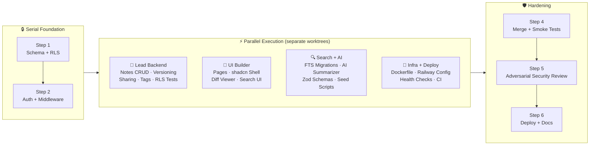
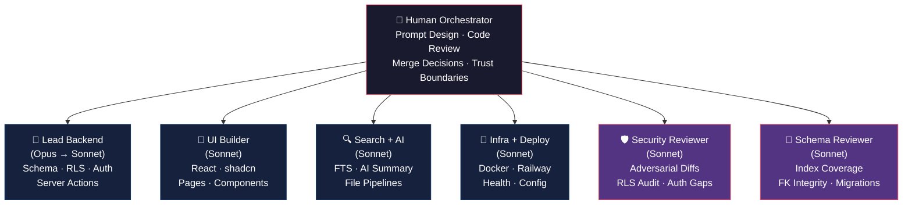

# AI Usage & Orchestration

This document outlines how the build process was structured, how work was divided across AI agents, and how quality control was managed. The primary strategy was to isolate domains so agents could work in parallel without stepping on each other, while maintaining strict human oversight over security-critical paths.

## Execution Strategy & Parallelization

Work was split across several parallel git worktrees, managing multiple terminal sessions to orchestrate the agents. This allowed momentum to be kept high while pausing to manually review critical code.

### Build Pipeline

- **Step 1:** Started with a single backend agent to establish the foundational schema, RLS policies, and basic tenant-isolation scaffolding. This phase had to be strictly serial; the database foundation had to be perfect before any parallel work began.

- **Step 2:** Still working sequentially, the agent built out authentication, middleware, and organization CRUD operations.

- **Step 3 (Parallel Execution):** Once the foundation was solid, four parallel tracks were spun up in separate worktrees:
  - **Lead Backend:** Notes CRUD, versioning, tagging, sharing logic, and isolation tests.
  - **UI Builder:** All UI pages, shadcn shell, diff viewer, and search interfaces.
  - **Search + AI:** Full-text search (FTS) migrations, AI summarizer logic, Zod schemas, and seed scripts.
  - **Infra + Deploy:** Dockerization, Railway configuration, health checks, and CI setup.

- **Step 4:** Branches were merged, seed scripts were run, and initial smoke tests were performed.

- **Step 5 (Hardening):** A dedicated adversarial review process was run using custom security-reviewer prompts. As bugs were flagged, they were verified by writing failing tests and then the real issues were fixed.

- **Step 6:** Final deployments, production migrations, and documentation cleanup.

### Agent Roles

## Where the Agents Excelled

- **Schema and RLS:** The agents correctly added `org_id` to all tables without much prompting and successfully implemented child-table EXISTS-join patterns for RLS (rather than just checking `is_org_member(org_id)`).
- **Server Actions:** They consistently followed a secure structure (`requireUser()` → `requireOrgAccess()` → `canEditNote()` → DB operations → `logAudit()`).
- **Defensive Search:** They correctly used `plainto_tsquery` instead of `to_tsquery` and explicitly added `eq(notes.orgId, orgId)` for defense-in-depth on top of RLS.
- **XSS Prevention:** When challenged with a stored XSS vulnerability in `ts_headline`, the agent successfully implemented the STX/ETX sentinel pattern to safely sanitize snippets.

## Where They Stumbled & How It Was Handled

While the agents were highly productive, they made several subtle errors that required direct intervention:

- **RLS Recursion:** The initial `note_shares` SELECT policy checked `notes`, which in turn checked `note_shares`, creating a circular dependency. This was caught during manual review of the policies and fixed.
- **Cross-Tenant Mutation Holes:** The RLS UPDATE policies blocked reading other orgs' data, but didn't explicitly block an attacker from changing the `org_id` field itself. The agents missed immutable-key triggers, which had to be enforced manually.
- **Middleware Trust Gaps:** The initial `requireUser()` implementation relied on `getSession()` which reads the JWT locally without full server validation. This was caught and a stricter server-side check was enforced.
- **FTS Tag Gap:** The search agent built the `search_tsv` for title and content but missed tags. None of the reviewing agents flagged this gap; it was caught during manual user testing and a fix was issued.
- **Security Reviewer False Positives:** The adversarial reviewer agent flagged ~22 issues. They were manually triaged: 11 were real bugs, 6 were false positives (often confusing Next.js server/client boundaries), and 3 were stylistic. Additionally, 2 bugs were caught that the reviewer missed entirely.

## Trust Boundaries

Strict human oversight was maintained over a few critical areas, refusing to trust the agents blindly:
- **RLS on Child Tables:** Drift between parent and child RLS logic is the top source of multi-tenant data leaks. Every RLS policy was manually read and verified.
- **AI Prompts:** The `lib/ai/summarize.ts` system prompt was audited line by line to guarantee that only a single note's content is passed per API call, preventing cross-tenant prompt injection.
- **File Upload Paths:** Sanitization logic was verified to ensure paths are strictly server-built (`<org>/<note>/<ulid>-<safename>`) to prevent traversal attacks.
- **Test Quality:** Agents tend to write tests with heavy mocking that pass trivially. The test suite was reviewed to ensure the core tenant-isolation tests used real Postgres JWT impersonation against the actual database.
