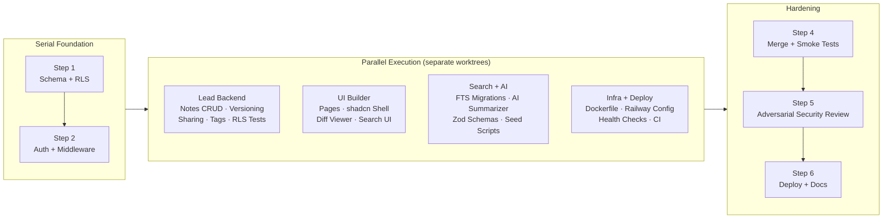
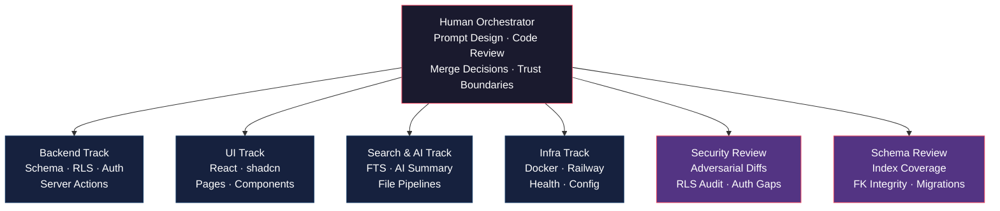

# Orchestration & Workflow

This document details the build process, workload distribution across parallel tracks, and quality control enforcement. The goal was domain isolation to enable parallel execution without merge conflicts, alongside rigorous manual review of security-critical paths.

## Execution Strategy

Work was organized into separate git worktrees, managing distinct logical domains. This enabled concurrent development while isolating the database and authentication foundation.

### Build Pipeline

- **Step 1:** Established the foundational Postgres schema, RLS policies, and basic tenant-isolation scaffolding. This had to be strictly serial; the database structure required absolute stability before concurrent work began.

- **Step 2:** Sequentially built out authentication logic, middleware routing, and organization CRUD operations.

- **Step 3 (Parallel Execution):** With a solid foundation, four parallel tracks were initiated in separate worktrees:
  - **Backend:** Notes CRUD, versioning, tagging, sharing logic, and isolation tests.
  - **Frontend:** UI pages, shadcn integration, diff viewer, and search interfaces.
  - **Search & AI:** Full-text search migrations, AI summarizer logic, Zod validation, and seed scripts.
  - **Infrastructure:** Dockerization, Railway configuration, health checks, and CI hooks.

- **Step 4:** Worktrees were merged into main, seed scripts executed, and initial smoke tests passed.

- **Step 5 (Hardening):** An adversarial security review was conducted against the merged codebase. Identified vulnerabilities were verified via failing tests, then patched.

- **Step 6:** Final deployments, production migrations, and documentation alignment.

### Component Roles

## Implementation Successes

- **Schema and RLS:** `org_id` was consistently applied across all tables. Implemented secure EXISTS-join patterns for child-table RLS rather than relying on basic `is_org_member` checks.
- **Server Actions:** Adopted a secure-by-default execution chain (`requireUser()` → `requireOrgAccess()` → `canEditNote()` → DB operations → `logAudit()`).
- **Defensive Search:** Utilized `plainto_tsquery` over `to_tsquery` to prevent syntax errors, and explicitly injected `eq(notes.orgId, orgId)` as a defense-in-depth measure alongside RLS.
- **XSS Prevention:** Addressed a stored XSS vector in `ts_headline` by implementing the STX/ETX sentinel pattern, safely sanitizing HTML snippets without destroying search highlighting.

## Vulnerabilities & Remediations

During development, several subtle architectural issues required targeted intervention:

- **RLS Recursion:** The initial `note_shares` SELECT policy checked `notes`, which in turn checked `note_shares`, resulting in an infinite recursion loop. This was identified and refactored.
- **Cross-Tenant Mutation Holes:** Early RLS UPDATE policies blocked unauthorized reads, but failed to explicitly prevent modifying the `org_id` field itself. Immutable-key triggers were introduced at the database level to close this gap.
- **Middleware Trust Gaps:** The initial authentication check relied on `getSession()`, which reads the JWT locally without server-side validation. This was upgraded to a strict `getUser()` check to ensure revoked sessions fail immediately.
- **FTS Tag Gap:** The initial `search_tsv` trigger indexed titles and content but omitted tags. This gap was discovered during manual testing and the trigger was rebuilt.
- **Review Noise:** The automated adversarial review surfaced ~22 issues. Triage confirmed 11 actual bugs, 6 false positives (due to Next.js server/client boundary confusion), and 3 stylistic notes. Two additional bugs were discovered manually.

## Trust Boundaries

Certain critical execution paths were isolated for manual validation exclusively:
- **RLS on Child Tables:** Drift between parent and child RLS logic is a primary vector for tenant data leaks. Every RLS policy was manually audited.
- **LLM Inputs:** The `lib/ai/summarize.ts` prompt construction was manually verified to ensure strict scoping—preventing cross-tenant prompt injection by passing only a single authorized note.
- **File Upload Paths:** Storage paths were locked to a server-side format (`<org>/<note>/<ulid>-<safename>`) to neutralize directory traversal attempts.
- **Test Fidelity:** Core tenant-isolation tests were written to use real Postgres JWT impersonation against the actual database, rather than relying on mocked ORM responses.
