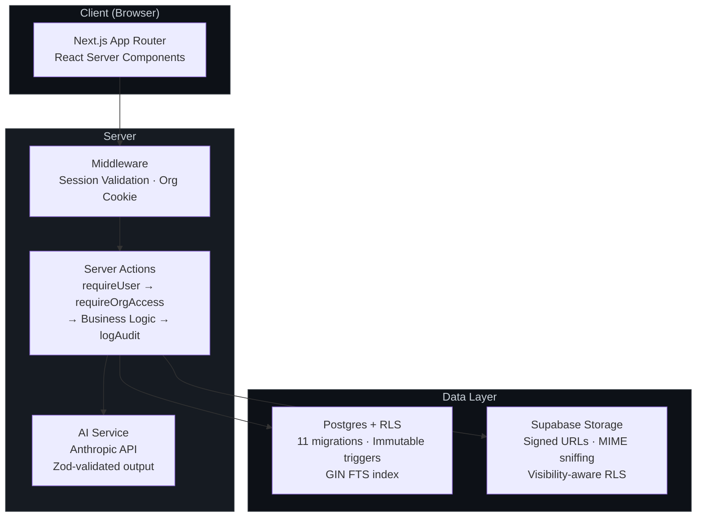
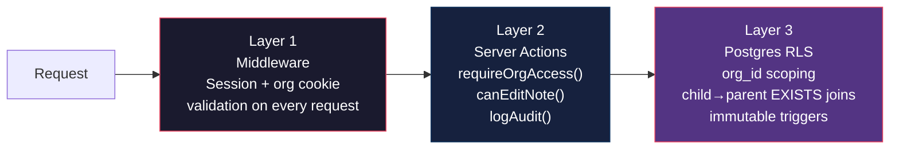
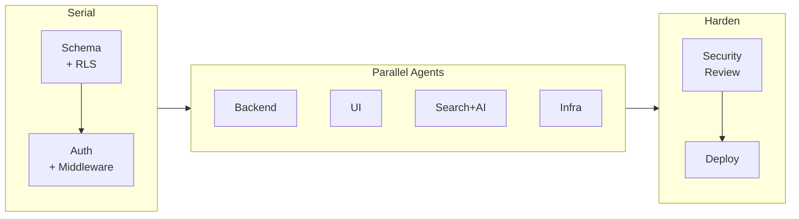

# Multi-Tenant Notes App

A secure, multi-tenant notes application built with Next.js, Drizzle ORM, and Supabase. Designed with strong tenant isolation, comprehensive audit logging, and AI-powered note summaries.

## Features

- **Multi-Tenancy & RBAC:** Users can belong to multiple organizations with specific roles (Owner, Admin, Member, Viewer). Strict Row Level Security (RLS) ensures data is never leaked across boundaries.
- **Note Management:** Full CRUD capabilities with tagging and selective sharing. Notes support versioning, allowing you to track changes and view diffs over time.
- **Full-Text Search:** High-performance search across note titles, content, and tags, powered by Postgres GIN-indexed `tsvector` queries.
- **File Attachments:** Secure file uploads via Supabase Storage. Files are scoped to specific notes and accessed via short-lived signed URLs.
- **AI Summarization:** Generate structured summaries, key points, and action items for any note. Users can selectively accept parts of the AI output to merge into their notes.
- **Audit Logging:** Every authentication event, mutation, AI request, and permission denial is logged for full operational visibility.

## Architecture



### Security Model (3 Layers)



### Agent-Orchestrated Build

This project was built using parallelized AI agents, each assigned a specific domain through custom system prompts. A human orchestrator managed all merge decisions, security reviews, and trust boundaries.



> For full details on the build process, agent roles, and what was caught during review, see [`AI_USAGE.md`](AI_USAGE.md).

## Tech Stack

| Layer | Technology |
|-------|-----------|
| Framework | Next.js (App Router) |
| Database & Auth | Supabase (Postgres) |
| ORM | Drizzle |
| Styling & UI | Tailwind CSS, shadcn/ui |
| Testing | Vitest |
| AI | Anthropic API |
| Deployment | Railway (Docker) |

## Local Development Setup

1. **Clone the repository:**
   ```bash
   git clone <repo-url>
   cd notes_app
   ```

2. **Install dependencies:**
   ```bash
   pnpm install
   ```

3. **Configure Environment Variables:**
   Copy `.env.example` to `.env.local` and fill in your Supabase and Anthropic keys.
   ```bash
   cp .env.example .env.local
   ```

4. **Run Database Migrations:**
   Ensure your local Supabase instance is running or connected to a remote DB, then push the schema:
   ```bash
   pnpm run db:push
   ```

5. **Start the Development Server:**
   ```bash
   pnpm dev
   ```

## Testing

The testing suite focuses heavily on security invariants and tenant isolation.
```bash
# Run unit and integration tests
pnpm test

# Run strict tenant-isolation suite
pnpm test:tenant-isolation
```

## Documentation

| Document | Purpose |
|----------|---------|
| [`AI_USAGE.md`](AI_USAGE.md) | Agent orchestration strategy, parallelization pipeline, and trust boundaries |
| [`REVIEW.md`](REVIEW.md) | Architectural trade-offs, security review notes, and acknowledged risks |
| [`BUGS.md`](BUGS.md) | Vulnerabilities caught and fixed during the hardening phase (with commit SHAs) |
